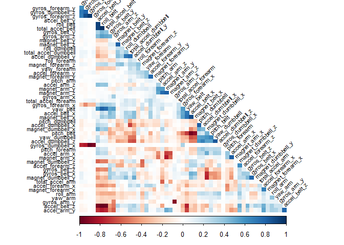

## Introduction  
Using devices such as Jawbone Up, Nike FuelBand, and Fitbit it is now possible to collect a large amount of data about personal activity relatively inexpensively. These type of devices are part of the quantified self movement - a group of enthusiasts who take measurements about themselves regularly to improve their health, to find patterns in their behavior, or because they are tech geeks. One thing that people regularly do is quantify how much of a particular activity they do, but they rarely quantify how well they do it. In this project, the goal was  to use data from accelerometers on the belt, forearm, arm, and dumbell of 6 participants. They were asked to perform barbell lifts correctly and incorrectly in 5 different ways. More information is available from the website here: http://web.archive.org/web/20161224072740/http:/groupware.les.inf.puc-rio.br/har.


### Load R Libraries 

```r
library(caret)
library(rpart)
library(rpart.plot)
library(randomForest)
library(corrplot)
library(tibble)
library(Rmisc)
library(ggplot2)
```
### Download and Read the Data from url
Direct download and read csv from url link into two data frames.

```r
trainRaw<- read.csv("https://d396qusza40orc.cloudfront.net/predmachlearn/pml-training.csv",header=TRUE)
testRaw <- read.csv("https://d396qusza40orc.cloudfront.net/predmachlearn/pml-testing.csv",header=TRUE)
dim(trainRaw)
```

```
## [1] 19622   160
```

```r
dim(testRaw)
```

```
## [1]  20 160
```
The training data set contains 19622 observations and 160 variables, while the testing data set contains 20 observations and 160 variables. The classe variable in the training set is the outcome to predict.

### Clean the data
In this step, we will clean the data and get rid of observations with missing values as well as some meaningless variables.(See appendix for summary prior to cleaning)

First, columns with NA missing values were removed.


```r
trainRaw <- trainRaw[, colSums(is.na(trainRaw)) == 0]
testRaw <- testRaw[, colSums(is.na(testRaw)) == 0]
```
Next, we get rid of some columns that do not contribute much to the accelerometer measurements.


```r
classe <- trainRaw$classe
trainRemove <- grepl("^X|timestamp|window", names(trainRaw))
trainRaw <- trainRaw[, !trainRemove]
trainCleaned <- trainRaw[, sapply(trainRaw, is.numeric)]
trainCleaned$classe <- classe
testRemove <- grepl("^X|timestamp|window", names(testRaw))
testRaw <- testRaw[, !testRemove]
testCleaned <- testRaw[, sapply(testRaw, is.numeric)]
```
Now, the cleaned training data set contains 19622 observations and 53 variables, while the testing data set contains 20 observations and 53 variables. The "classe" variable is still in the cleaned training set.

### Slice the data into training and test sets
Then, we can split the cleaned training set into a pure training data set (60%) and a validation data set (40%). The validation data set will be used to conduct cross validation in future steps.  


```r
set.seed(20000) # For reproducibile purpose
inTrain <- createDataPartition(trainCleaned$classe, p=0.60, list=F)
trainData <- trainCleaned[inTrain, ]
testData <- trainCleaned[-inTrain, ]
```

Perform exploratory analysis review of trainData

```r
p1 <- ggplot(trainData, aes(classe,pitch_forearm)) + 
  geom_boxplot(aes(fill=classe))
p2 <- ggplot(trainData, aes(classe, magnet_arm_x)) + 
  geom_boxplot(aes(fill=classe))
multiplot(p1,p2,cols=2)
```

<!-- -->
## Model Selection 
After reviewing the box plots in the previous step, it does not appear a linear regression model will be a good fit for this data. Instead, we will utilize the method known as "Random Forest" which will automatically select important variables and utilize the 5-Fold cross validation when applying the algorithm.


```r
controlRf <- trainControl(method="cv", 5)
modelRf <- train(classe ~ ., data=trainData, method="rf", trControl=controlRf, ntree=150)
modelRf
```

```
## Random Forest 
## 
## 11776 samples
##    52 predictor
##     5 classes: 'A', 'B', 'C', 'D', 'E' 
## 
## No pre-processing
## Resampling: Cross-Validated (5 fold) 
## Summary of sample sizes: 9420, 9421, 9423, 9420, 9420 
## Resampling results across tuning parameters:
## 
##   mtry  Accuracy   Kappa    
##    2    0.9865823  0.9830237
##   27    0.9876019  0.9843141
##   52    0.9827594  0.9781860
## 
## Accuracy was used to select the optimal model using the largest value.
## The final value used for the model was mtry = 27.
```

Now it's time to test our training model against our test data and estimate the performance of the model.  


```r
predictRf <- predict(modelRf, testData)
confusionMatrix(testData$classe, predictRf)
```

```
## Confusion Matrix and Statistics
## 
##           Reference
## Prediction    A    B    C    D    E
##          A 2226    4    2    0    0
##          B    7 1500   11    0    0
##          C    0    9 1353    6    0
##          D    0    1   18 1266    1
##          E    0    1    4    3 1434
## 
## Overall Statistics
##                                           
##                Accuracy : 0.9915          
##                  95% CI : (0.9892, 0.9934)
##     No Information Rate : 0.2846          
##     P-Value [Acc > NIR] : < 2.2e-16       
##                                           
##                   Kappa : 0.9892          
##  Mcnemar's Test P-Value : NA              
## 
## Statistics by Class:
## 
##                      Class: A Class: B Class: C Class: D Class: E
## Sensitivity            0.9969   0.9901   0.9748   0.9929   0.9993
## Specificity            0.9989   0.9972   0.9977   0.9970   0.9988
## Pos Pred Value         0.9973   0.9881   0.9890   0.9844   0.9945
## Neg Pred Value         0.9988   0.9976   0.9946   0.9986   0.9998
## Prevalence             0.2846   0.1931   0.1769   0.1625   0.1829
## Detection Rate         0.2837   0.1912   0.1724   0.1614   0.1828
## Detection Prevalence   0.2845   0.1935   0.1744   0.1639   0.1838
## Balanced Accuracy      0.9979   0.9936   0.9862   0.9949   0.9990
```


```r
accuracy <- postResample(predictRf, testData$classe)
accuracy
```

```
##  Accuracy     Kappa 
## 0.9914606 0.9891987
```


```r
ooser <- 1 - as.numeric(confusionMatrix(testData$classe, predictRf)$overall[1])
ooser
```

```
## [1] 0.008539383
```

So, the estimated accuracy of the model is 99.30% and the estimated out-of-sample error is 0.85%.

## Predicting for Test Data Set
Now, we apply the model to the original testing data set downloaded from the data source. We remove the `problem_id` column first.  


```r
result <- predict(modelRf, testCleaned[, -length(names(testCleaned))])
result
```

```
##  [1] B A B A A E D B A A B C B A E E A B B B
## Levels: A B C D E
```

## Appendix: Figures
1. Look at data

```
## Observations: 19,622
## Variables: 87
## $ user_name               <fct> carlitos, carlitos, carlitos, carlitos...
## $ roll_belt               <dbl> 1.41, 1.41, 1.42, 1.48, 1.48, 1.45, 1....
## $ pitch_belt              <dbl> 8.07, 8.07, 8.07, 8.05, 8.07, 8.06, 8....
## $ yaw_belt                <dbl> -94.4, -94.4, -94.4, -94.4, -94.4, -94...
## $ total_accel_belt        <int> 3, 3, 3, 3, 3, 3, 3, 3, 3, 3, 3, 3, 3,...
## $ kurtosis_roll_belt      <fct> , , , , , , , , , , , , , , , , , , , ...
## $ kurtosis_picth_belt     <fct> , , , , , , , , , , , , , , , , , , , ...
## $ kurtosis_yaw_belt       <fct> , , , , , , , , , , , , , , , , , , , ...
## $ skewness_roll_belt      <fct> , , , , , , , , , , , , , , , , , , , ...
## $ skewness_roll_belt.1    <fct> , , , , , , , , , , , , , , , , , , , ...
## $ skewness_yaw_belt       <fct> , , , , , , , , , , , , , , , , , , , ...
## $ max_yaw_belt            <fct> , , , , , , , , , , , , , , , , , , , ...
## $ min_yaw_belt            <fct> , , , , , , , , , , , , , , , , , , , ...
## $ amplitude_yaw_belt      <fct> , , , , , , , , , , , , , , , , , , , ...
## $ gyros_belt_x            <dbl> 0.00, 0.02, 0.00, 0.02, 0.02, 0.02, 0....
## $ gyros_belt_y            <dbl> 0.00, 0.00, 0.00, 0.00, 0.02, 0.00, 0....
## $ gyros_belt_z            <dbl> -0.02, -0.02, -0.02, -0.03, -0.02, -0....
## $ accel_belt_x            <int> -21, -22, -20, -22, -21, -21, -22, -22...
## $ accel_belt_y            <int> 4, 4, 5, 3, 2, 4, 3, 4, 2, 4, 2, 2, 4,...
## $ accel_belt_z            <int> 22, 22, 23, 21, 24, 21, 21, 21, 24, 22...
## $ magnet_belt_x           <int> -3, -7, -2, -6, -6, 0, -4, -2, 1, -3, ...
## $ magnet_belt_y           <int> 599, 608, 600, 604, 600, 603, 599, 603...
## $ magnet_belt_z           <int> -313, -311, -305, -310, -302, -312, -3...
## $ roll_arm                <dbl> -128, -128, -128, -128, -128, -128, -1...
## $ pitch_arm               <dbl> 22.5, 22.5, 22.5, 22.1, 22.1, 22.0, 21...
## $ yaw_arm                 <dbl> -161, -161, -161, -161, -161, -161, -1...
## $ total_accel_arm         <int> 34, 34, 34, 34, 34, 34, 34, 34, 34, 34...
## $ gyros_arm_x             <dbl> 0.00, 0.02, 0.02, 0.02, 0.00, 0.02, 0....
## $ gyros_arm_y             <dbl> 0.00, -0.02, -0.02, -0.03, -0.03, -0.0...
## $ gyros_arm_z             <dbl> -0.02, -0.02, -0.02, 0.02, 0.00, 0.00,...
## $ accel_arm_x             <int> -288, -290, -289, -289, -289, -289, -2...
## $ accel_arm_y             <int> 109, 110, 110, 111, 111, 111, 111, 111...
## $ accel_arm_z             <int> -123, -125, -126, -123, -123, -122, -1...
## $ magnet_arm_x            <int> -368, -369, -368, -372, -374, -369, -3...
## $ magnet_arm_y            <int> 337, 337, 344, 344, 337, 342, 336, 338...
## $ magnet_arm_z            <int> 516, 513, 513, 512, 506, 513, 509, 510...
## $ kurtosis_roll_arm       <fct> , , , , , , , , , , , , , , , , , , , ...
## $ kurtosis_picth_arm      <fct> , , , , , , , , , , , , , , , , , , , ...
## $ kurtosis_yaw_arm        <fct> , , , , , , , , , , , , , , , , , , , ...
## $ skewness_roll_arm       <fct> , , , , , , , , , , , , , , , , , , , ...
## $ skewness_pitch_arm      <fct> , , , , , , , , , , , , , , , , , , , ...
## $ skewness_yaw_arm        <fct> , , , , , , , , , , , , , , , , , , , ...
## $ roll_dumbbell           <dbl> 13.05217, 13.13074, 12.85075, 13.43120...
## $ pitch_dumbbell          <dbl> -70.49400, -70.63751, -70.27812, -70.3...
## $ yaw_dumbbell            <dbl> -84.87394, -84.71065, -85.14078, -84.8...
## $ kurtosis_roll_dumbbell  <fct> , , , , , , , , , , , , , , , , , , , ...
## $ kurtosis_picth_dumbbell <fct> , , , , , , , , , , , , , , , , , , , ...
## $ kurtosis_yaw_dumbbell   <fct> , , , , , , , , , , , , , , , , , , , ...
## $ skewness_roll_dumbbell  <fct> , , , , , , , , , , , , , , , , , , , ...
## $ skewness_pitch_dumbbell <fct> , , , , , , , , , , , , , , , , , , , ...
## $ skewness_yaw_dumbbell   <fct> , , , , , , , , , , , , , , , , , , , ...
## $ max_yaw_dumbbell        <fct> , , , , , , , , , , , , , , , , , , , ...
## $ min_yaw_dumbbell        <fct> , , , , , , , , , , , , , , , , , , , ...
## $ amplitude_yaw_dumbbell  <fct> , , , , , , , , , , , , , , , , , , , ...
## $ total_accel_dumbbell    <int> 37, 37, 37, 37, 37, 37, 37, 37, 37, 37...
## $ gyros_dumbbell_x        <dbl> 0.00, 0.00, 0.00, 0.00, 0.00, 0.00, 0....
## $ gyros_dumbbell_y        <dbl> -0.02, -0.02, -0.02, -0.02, -0.02, -0....
## $ gyros_dumbbell_z        <dbl> 0.00, 0.00, 0.00, -0.02, 0.00, 0.00, 0...
## $ accel_dumbbell_x        <int> -234, -233, -232, -232, -233, -234, -2...
## $ accel_dumbbell_y        <int> 47, 47, 46, 48, 48, 48, 47, 46, 47, 48...
## $ accel_dumbbell_z        <int> -271, -269, -270, -269, -270, -269, -2...
## $ magnet_dumbbell_x       <int> -559, -555, -561, -552, -554, -558, -5...
## $ magnet_dumbbell_y       <int> 293, 296, 298, 303, 292, 294, 295, 300...
## $ magnet_dumbbell_z       <dbl> -65, -64, -63, -60, -68, -66, -70, -74...
## $ roll_forearm            <dbl> 28.4, 28.3, 28.3, 28.1, 28.0, 27.9, 27...
## $ pitch_forearm           <dbl> -63.9, -63.9, -63.9, -63.9, -63.9, -63...
## $ yaw_forearm             <dbl> -153, -153, -152, -152, -152, -152, -1...
## $ kurtosis_roll_forearm   <fct> , , , , , , , , , , , , , , , , , , , ...
## $ kurtosis_picth_forearm  <fct> , , , , , , , , , , , , , , , , , , , ...
## $ kurtosis_yaw_forearm    <fct> , , , , , , , , , , , , , , , , , , , ...
## $ skewness_roll_forearm   <fct> , , , , , , , , , , , , , , , , , , , ...
## $ skewness_pitch_forearm  <fct> , , , , , , , , , , , , , , , , , , , ...
## $ skewness_yaw_forearm    <fct> , , , , , , , , , , , , , , , , , , , ...
## $ max_yaw_forearm         <fct> , , , , , , , , , , , , , , , , , , , ...
## $ min_yaw_forearm         <fct> , , , , , , , , , , , , , , , , , , , ...
## $ amplitude_yaw_forearm   <fct> , , , , , , , , , , , , , , , , , , , ...
## $ total_accel_forearm     <int> 36, 36, 36, 36, 36, 36, 36, 36, 36, 36...
## $ gyros_forearm_x         <dbl> 0.03, 0.02, 0.03, 0.02, 0.02, 0.02, 0....
## $ gyros_forearm_y         <dbl> 0.00, 0.00, -0.02, -0.02, 0.00, -0.02,...
## $ gyros_forearm_z         <dbl> -0.02, -0.02, 0.00, 0.00, -0.02, -0.03...
## $ accel_forearm_x         <int> 192, 192, 196, 189, 189, 193, 195, 193...
## $ accel_forearm_y         <int> 203, 203, 204, 206, 206, 203, 205, 205...
## $ accel_forearm_z         <int> -215, -216, -213, -214, -214, -215, -2...
## $ magnet_forearm_x        <int> -17, -18, -18, -16, -17, -9, -18, -9, ...
## $ magnet_forearm_y        <dbl> 654, 661, 658, 658, 655, 660, 659, 660...
## $ magnet_forearm_z        <dbl> 476, 473, 469, 469, 473, 478, 470, 474...
## $ classe                  <fct> A, A, A, A, A, A, A, A, A, A, A, A, A,...
```

2. Correlation Matrix Visualization  


```r
corrPlot <- cor(trainData[, -length(names(trainData))])
corrplot(corrPlot, method="color", type="lower", order="hclust", tl.cex=0.70, tl.col="black", tl.srt = 45, diag = FALSE)
```

<!-- -->

3. Decision Tree Visualization


```r
treeModel <- rpart(classe ~ ., data=trainData, method="class")
prp(treeModel) # fast plot
```

<!-- -->
